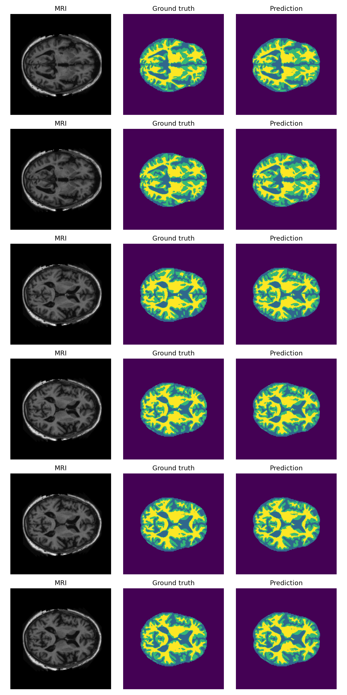
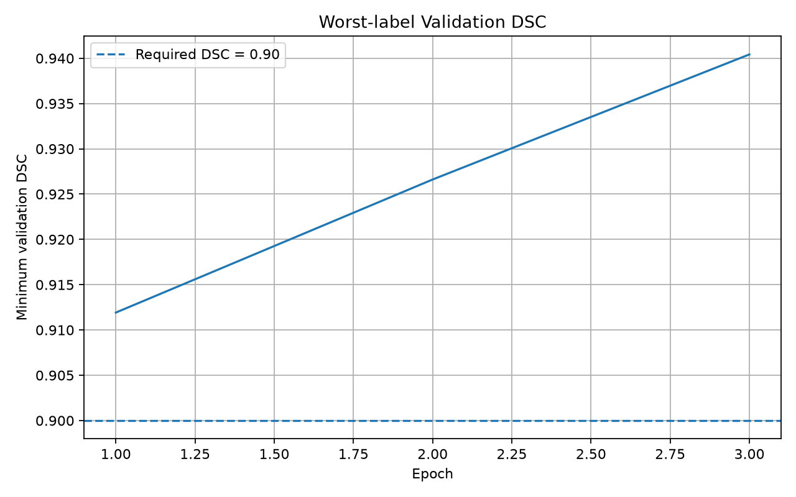
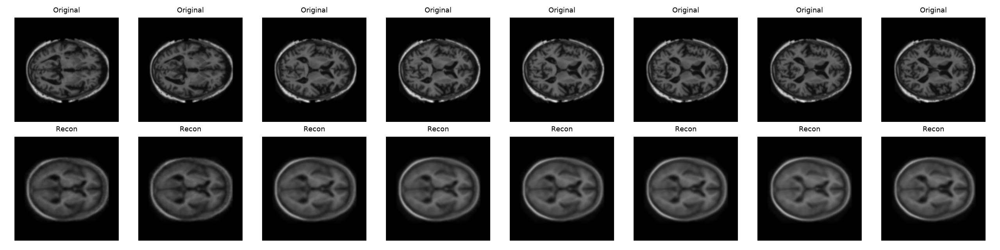
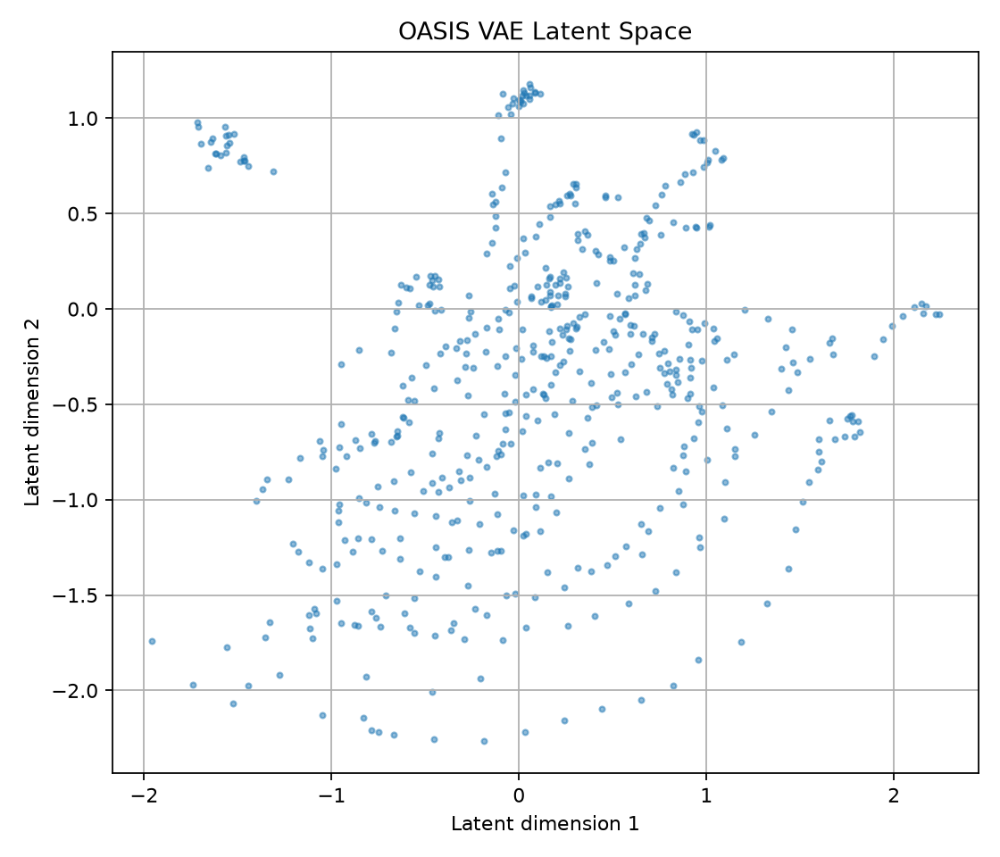
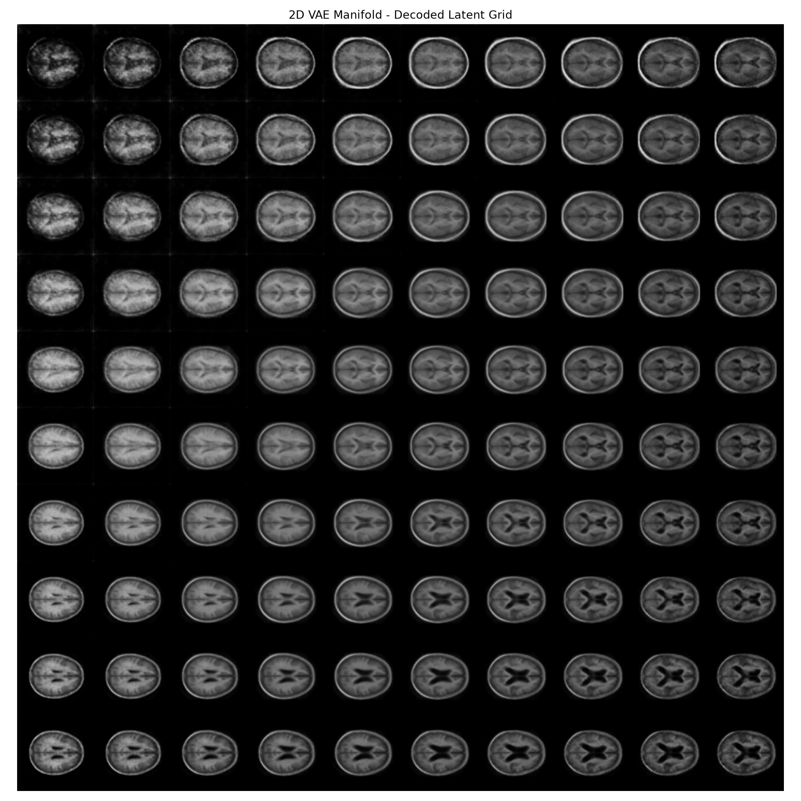

# Brain MRI Deep Learning with U-Net and VAE

A deep learning project exploring brain MRI image analysis using
U-Net and Variational Autoencoder (VAE).

The project focuses on image segmentation and latent representation
learning using the OASIS brain MRI dataset.

## Project Overview

This project implements two deep learning architectures:

- **U-Net** for brain MRI image segmentation
- **Variational Autoencoder (VAE)** for learning latent representations
  of brain MRI images

The models were implemented using PyTorch and evaluated through
training loss, Dice score, reconstruction quality, and latent-space
visualisation.

## Dataset

The project uses preprocessed brain MRI images from the
**OASIS (Open Access Series of Imaging Studies)** dataset.

## U-Net

U-Net was used to perform image segmentation on brain MRI images.

Model performance was evaluated using:

- Training loss
- Dice score
- Segmentation visualisation

### Segmentation Results

### Training Loss

### Dice Score

## Variational Autoencoder

A Variational Autoencoder (VAE) was implemented to learn a compact
latent representation of brain MRI images.

The model was evaluated using:

- Reconstruction loss
- Image reconstruction quality
- Latent-space distribution
- Latent manifold visualisation

### Reconstruction

### Training Loss

### Latent Space

### Latent Manifold

## Technologies

- Python
- PyTorch
- NumPy
- Matplotlib
- Deep Learning
- Computer Vision

## Skills Demonstrated

- Deep learning model implementation with PyTorch
- Medical image analysis
- Image segmentation using U-Net
- Representation learning using Variational Autoencoders
- Model evaluation using Dice score and training loss
- Visualisation of learned latent representations

## Project Context

This project was developed as part of COMP3710 at
The University of Queensland.
