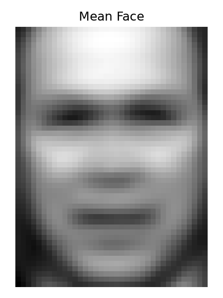
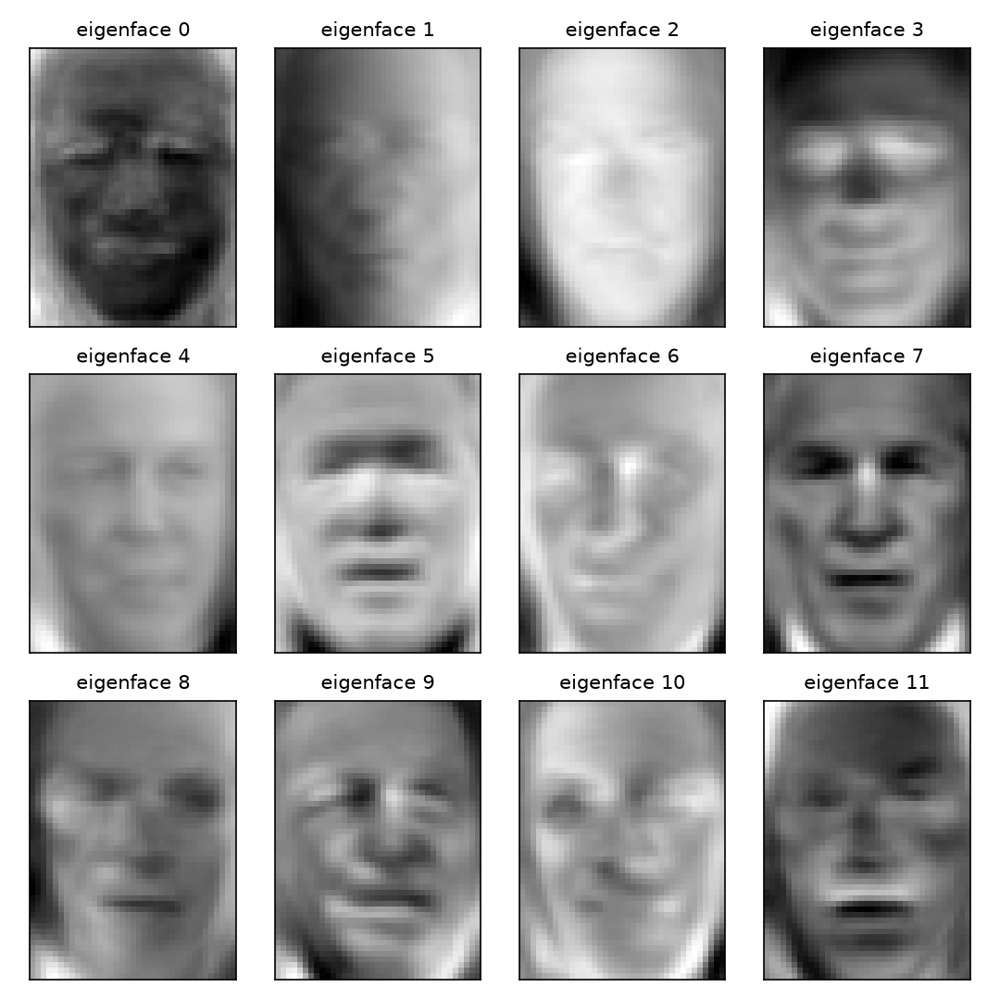
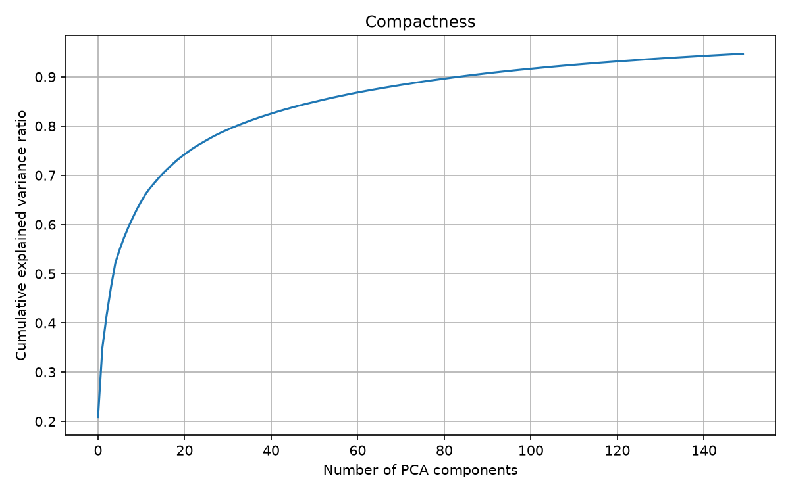
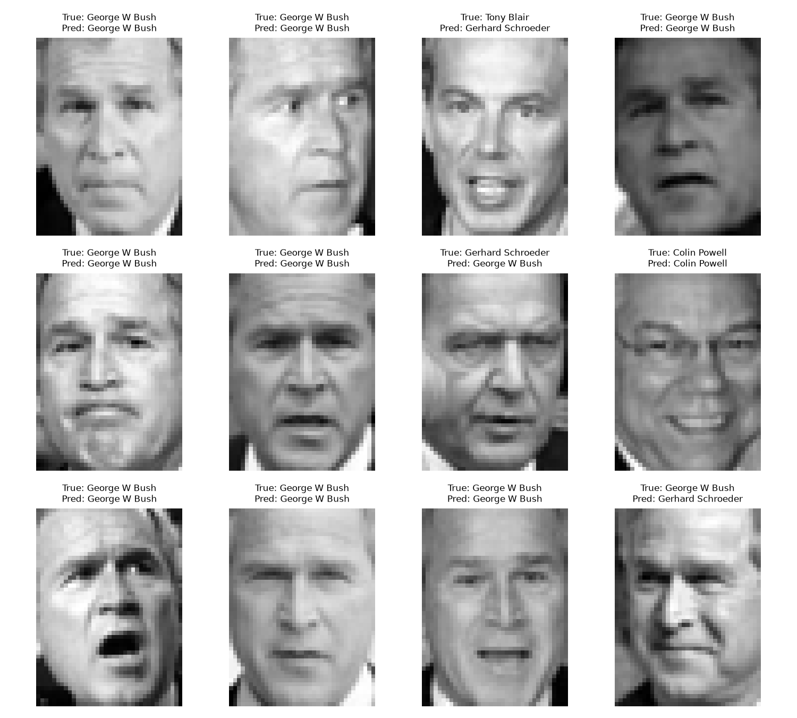
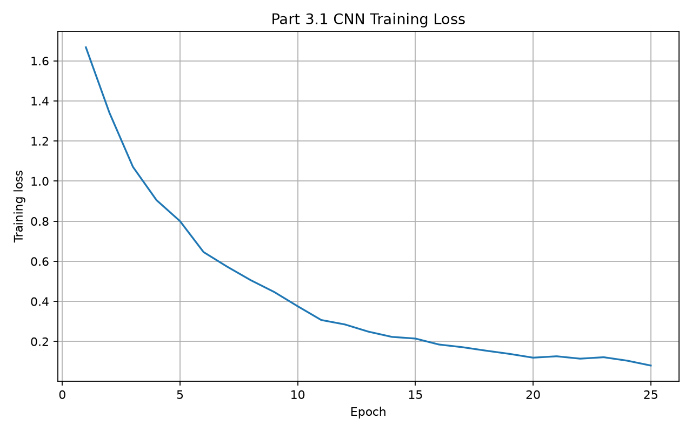
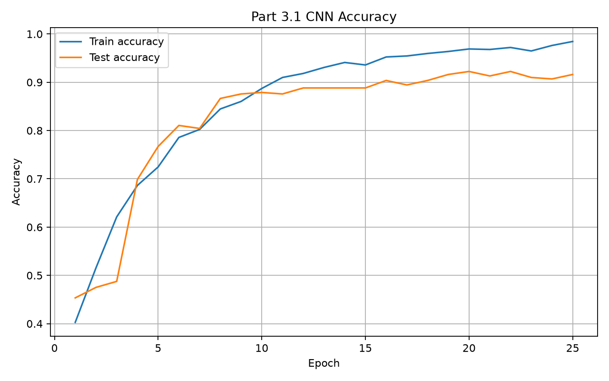
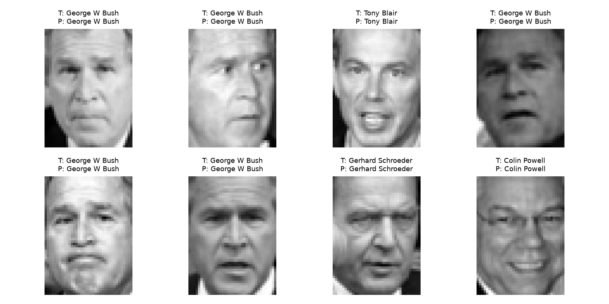
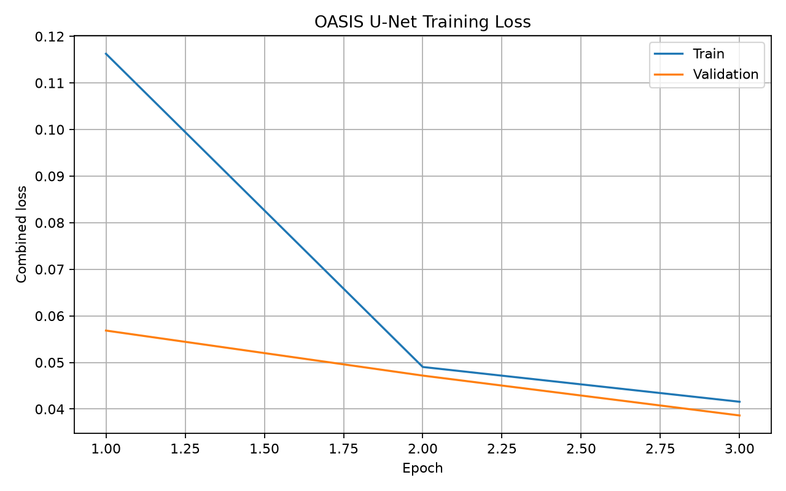
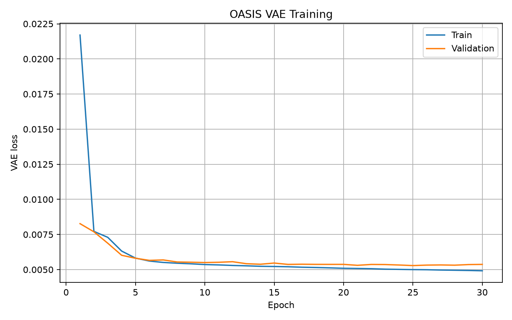

# Computer Vision and Deep Learning Portfolio

A collection of computer vision and deep learning experiments covering signal analysis, dimensionality reduction, image classification, residual networks, medical image segmentation, and generative representation learning.

The repository brings together several connected projects developed with **Python, PyTorch, NumPy, Matplotlib, and scikit-learn**, moving from classical numerical methods to modern deep learning architectures.

---

## Overview

The work is organised into four main areas:

1. **Fourier Analysis and GPU Computing**  
   Fourier-series reconstruction, direct DFT implementation, FFT comparison, and GPU-accelerated numerical computation.

2. **PCA, Eigenfaces, and Classical Face Recognition**  
   Dimensionality reduction with PCA/SVD on the Labeled Faces in the Wild dataset, followed by Random Forest classification.

3. **Deep Learning for Image Classification**  
   A CNN for face recognition and a ResNet-18 implementation for CIFAR-10 classification.

4. **Medical Image Analysis with U-Net and VAE**  
   Brain MRI segmentation and latent representation learning using the OASIS dataset.

This progression demonstrates how image and signal representations evolve from handcrafted mathematical transformations to learned hierarchical features and medical-imaging applications.

---

# 1. Fourier Analysis and GPU-Accelerated DFT

**File:** `fourier_analysis_gpu.ipynb`

This project explores the relationship between time-domain signals, frequency-domain representations, computational complexity, and GPU acceleration.

### Main components

- Reconstructed a square wave using a finite sum of odd Fourier harmonics
- Investigated the **Gibbs phenomenon** near signal discontinuities
- Implemented a direct **Discrete Fourier Transform (DFT)**
- Compared direct DFT with the **Fast Fourier Transform (FFT)**
- Reimplemented Fourier-related operations with **PyTorch tensors**
- Implemented an explicit GPU-based direct DFT without relying on `torch.fft`
- Benchmarked NumPy DFT, NumPy FFT, and PyTorch GPU DFT across different input sizes

### Key concepts

The direct DFT requires approximately:

```text
O(N²)
```

operations, while FFT reduces the complexity to approximately:

```text
O(N log N)
```

The experiments show that GPU parallelism can accelerate large direct computations, but hardware acceleration does not replace the advantage of a more efficient algorithm.

### Skills demonstrated

- Fourier analysis
- Numerical computing
- Signal processing
- Algorithmic complexity analysis
- PyTorch tensor programming
- CUDA/GPU computation
- Performance benchmarking

---

# 2. Eigenfaces and PCA for Face Recognition

**File:** `eigenfaces_pca.ipynb`

This project applies **Principal Component Analysis (PCA)** to face images from the **Labeled Faces in the Wild (LFW)** dataset.

The objective is to reduce the dimensionality of high-dimensional image data while preserving informative variation for face recognition.

### Pipeline

1. Load and inspect LFW face images
2. Split the dataset into training and testing subsets
3. Compute the mean face
4. Mean-centre the image data
5. Apply **Singular Value Decomposition (SVD)**
6. Extract the leading principal components
7. Visualise the resulting **eigenfaces**
8. Project face images into the PCA feature space
9. Train a **Random Forest classifier**
10. Evaluate identity classification on held-out test data

### Result

The PCA + Random Forest baseline achieved approximately:

**60.56% test accuracy**

This experiment provides a classical machine-learning baseline for comparison with the CNN-based face classifier in the next section.

### Example outputs

#### Mean face



#### Eigenfaces



#### PCA compactness / explained variance



#### Example predictions



### Skills demonstrated

- Principal Component Analysis
- Singular Value Decomposition
- Dimensionality reduction
- Feature extraction
- Random Forest classification
- Face recognition
- Model evaluation
- Scientific visualisation

---

# 3. Deep Learning for Image Classification

## 3.1 CNN Face Classification

**File:** `face_cnn.ipynb`

This project develops a convolutional neural network for face classification using the same LFW face-recognition setting.

Unlike the PCA pipeline, the CNN learns useful image features directly from the training data.

### Model architecture

The network includes:

- Two convolutional layers
- Batch Normalisation
- ReLU activations
- Max Pooling
- Fully connected classification layer
- Dropout regularisation
- Multi-class output layer

The model is trained with **CrossEntropyLoss** and the **Adam** optimiser.

### Result

The CNN achieved approximately:

**91.61% test accuracy**

This represents a substantial improvement over the PCA + Random Forest baseline.

| Method | Test Accuracy |
|---|---:|
| PCA + Random Forest | 60.56% |
| CNN | 91.61% |

The comparison demonstrates the benefit of learning hierarchical spatial features directly from image data.

### Training loss



### Training and test accuracy



### Example predictions



### Skills demonstrated

- CNN architecture design
- PyTorch model training
- Multi-class image classification
- Batch Normalisation
- Dropout regularisation
- Training-curve analysis
- Quantitative and qualitative evaluation

---

## 3.2 ResNet-18 on CIFAR-10

**File:** `resnet18_cifar10.py`

This project implements a **ResNet-18-style architecture** for image classification on the **CIFAR-10** dataset.

The model uses residual learning to allow deeper networks to optimise more effectively.

### Architecture

The implementation includes:

- Custom `BasicBlock`
- Residual skip connections
- Four residual stages
- Batch Normalisation
- ReLU activations
- Adaptive average pooling
- Final fully connected classifier

The residual connection follows the core idea:

```python
out = self.relu(out + identity)
```

### Training strategy

The training pipeline includes:

- Random cropping
- Random horizontal flipping
- Random erasing
- CIFAR-10 normalisation
- SGD with momentum
- Weight decay
- Nesterov acceleration
- OneCycleLR scheduling
- Mixed-precision training when CUDA is available
- Checkpoint saving
- Periodic evaluation
- Optional early stopping based on target accuracy

The implementation also uses GPU-oriented optimisations such as non-blocking transfers, channels-last memory format, and CUDA mixed precision when supported.

### Skills demonstrated

- Residual neural networks
- Custom deep-learning architecture implementation
- Data augmentation
- Training optimisation
- Mixed-precision training
- Learning-rate scheduling
- GPU-aware PyTorch programming
- Checkpointing and inference

---

# 4. Brain MRI Deep Learning with U-Net and VAE

**Files:** `Unet.py`, `vae.py`

This project applies deep learning to **brain MRI analysis** using the **OASIS (Open Access Series of Imaging Studies)** dataset.

It combines two different deep-learning objectives:

- **U-Net** for medical image segmentation
- **Variational Autoencoder (VAE)** for reconstruction and latent representation learning

This section is especially focused on the use of deep learning for medical imaging.

---

## 4.1 U-Net Brain MRI Segmentation

U-Net is used to segment anatomical structures in brain MRI images.

The encoder-decoder architecture combines high-level semantic features with fine spatial information through skip connections.

### Evaluation

Model performance is evaluated using:

- Training loss
- Dice score
- Segmentation visualisation

### Segmentation result


### Training loss



### Dice score


### Skills demonstrated

- Medical image segmentation
- Encoder-decoder architectures
- Skip connections
- Dice-based evaluation
- PyTorch image-processing pipelines
- Segmentation visualisation

---

## 4.2 Variational Autoencoder for Brain MRI

A **Variational Autoencoder (VAE)** is used to learn compact latent representations of brain MRI images.

The model learns to encode high-dimensional images into a lower-dimensional latent space and reconstruct the original inputs.

### Evaluation

The VAE is analysed using:

- Reconstruction loss
- Reconstructed MRI images
- Latent-space distributions
- Latent manifold visualisation

### Reconstruction


### Training loss



### Latent-space representation


### Latent manifold


### Skills demonstrated

- Variational Autoencoders
- Representation learning
- Latent-space analysis
- Image reconstruction
- Generative deep learning
- Medical image analysis

---

# Technical Stack

### Programming

- Python

### Deep Learning

- PyTorch
- Convolutional Neural Networks
- ResNet
- U-Net
- Variational Autoencoders

### Machine Learning

- PCA
- SVD
- Random Forest
- Feature extraction
- Dimensionality reduction

### Numerical and Scientific Computing

- NumPy
- Matplotlib
- Fourier analysis
- DFT / FFT
- GPU computing

### Datasets

- **Labeled Faces in the Wild (LFW)** — face recognition
- **CIFAR-10** — image classification
- **OASIS** — brain MRI analysis

---

# Repository Structure

```text
computer-vision-deep-learning/
│
├── README.md
├── fourier_analysis_gpu.ipynb
├── eigenfaces_pca.ipynb
├── face_cnn.ipynb
├── resnet18_cifar10.py
├── Unet.py
├── vae.py
│
└── result/
    ├── part2_mean_face.png
    ├── part2_eigenfaces.png
    ├── part2_compactness.png
    ├── part2_predictions.png
    ├── part3_1_loss.png
    ├── part3_1_accuracy.png
    ├── part3_1_predictions.png
    ├── p4_unet_loss.png
    ├── p4_unet_dice.png
    ├── p4_unet_segmentation.png
    ├── p4_vae_loss.png
    ├── p4_vae_reconstruction.png
    ├── p4_vae_latent_scatter.png
    └── p4_vae_manifold.png
```

---

# What This Portfolio Demonstrates

Across these projects, I worked with both classical and deep-learning approaches to image and signal analysis.

The portfolio shows progression across:

- mathematical signal representation,
- dimensionality reduction,
- classical machine learning,
- convolutional neural networks,
- residual learning,
- medical image segmentation,
- and generative representation learning.

It also demonstrates practical experience with model implementation, GPU-aware computation, training and evaluation pipelines, visualisation, and analysis of experimental results.

---

# Project Context

These projects were developed as part of **COMP3710** at **The University of Queensland**.

The repository has been reorganised as a technical portfolio to present the methods, implementations, and experimental results in a clear and reproducible format.
